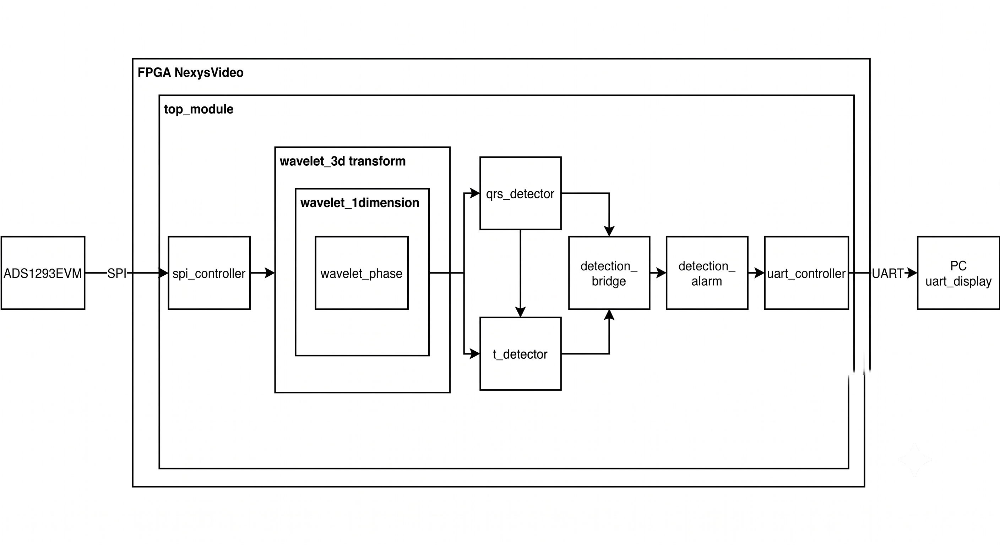
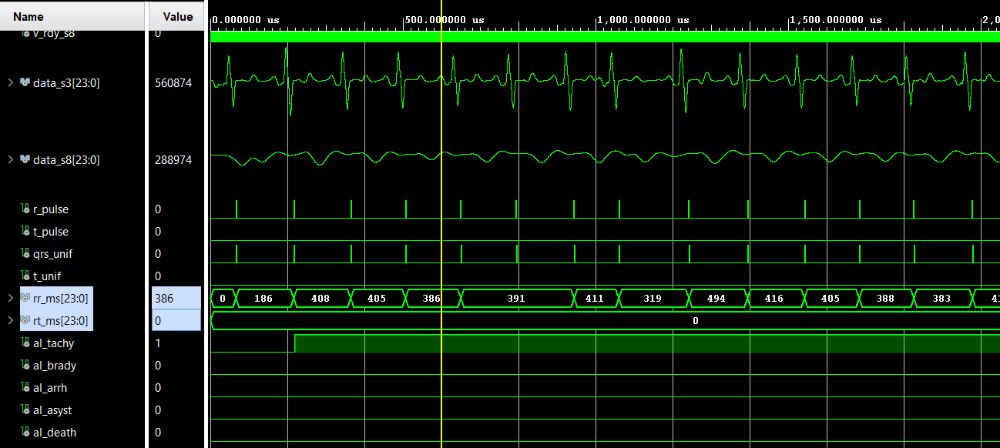
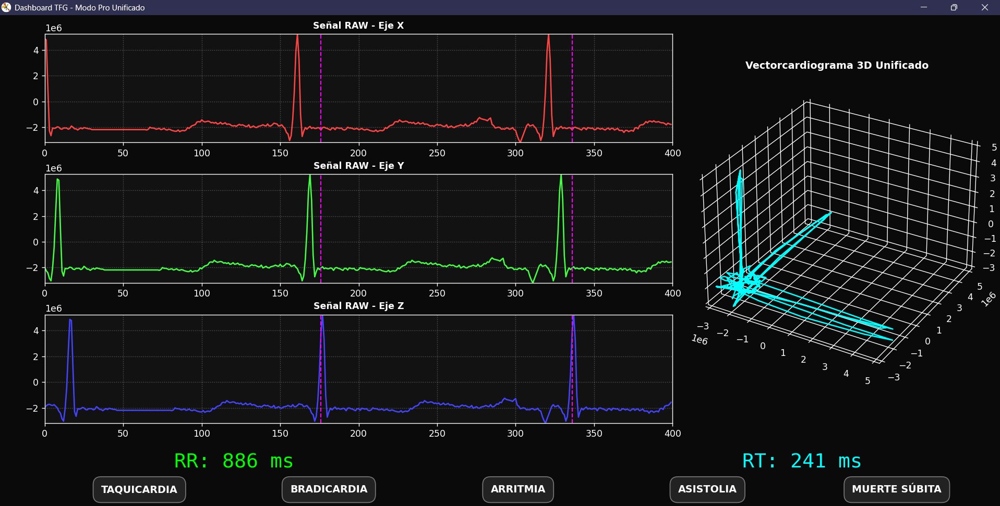
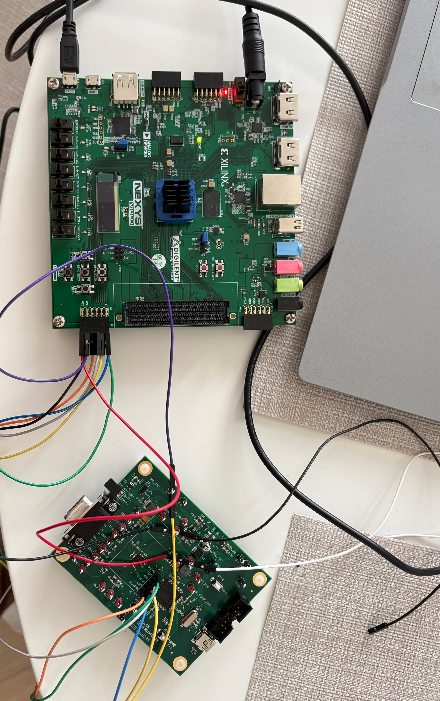

# Study of Cardiac Pathologies using Electrocardiogram and Vectorcardiogram

[Read the full Thesis (PDF)](docs/Thesis.pdf)

## 1. Introduction

Cardiovascular diseases are the leading cause of global mortality, often due to unexpected electrical failures in the heart. Traditionally, the 12-lead electrocardiogram (ECG) has been the standard test; however, it has limitations in clearly evaluating complex areas like the posterior wall of the myocardium. Vectorcardiography (VCG) solves this by studying the heart's electricity in three spatial dimensions (X, Y, Z). The drawback is that clinical VCG equipment is very large and expensive.

The goal of this project is to simplify this technology. To achieve this, a portable digital system has been designed and implemented on an **Artix-7 FPGA** capable of filtering the cardiac signal, processing it in parallel in 3D, and automatically calculating the critical RR and RT intervals in real-time to warn about various cardiac pathologies.

## 2. Design and Implementation

The system features a modular digital architecture programmed in VHDL, designed to process the three spatial channels strictly simultaneously without bottlenecks. The following block diagram illustrates this unidirectional data flow: it begins with the SPI acquisition from the analog sensor, moves through the 3D Wavelet transform and adaptive detectors, unifies the data in the detection bridge, evaluates clinical alarms, and finally transmits the packaged data via UART to the PC interface.

### Core Digital Architecture
* **3D Wavelet Transform Filtering:** The system applies the *à trous* algorithm with cubic splines. To optimize the FPGA resources, it uses rapid bit-shifting operations instead of physical DSP multipliers. It decomposes the signal into scales, isolating the QRS complex (high frequencies on scale 3) and the T wave (low frequencies on scale 8).
* **Adaptive Event Detector:** Two independent synchronous state machines locate the exact peak of the R wave and the end of the T wave. They use a "virtual zero" and dynamic maximum/minimum thresholds that automatically divide and recalculate on each heartbeat to adapt to the patient's real amplitude and rhythm.
* **Unification and Calibration (Majority Voting):** To avoid false positives caused by noise, a Detection Bridge centralizes the axes applying a majority voting rule (a beat is validated only if at least two axes coincide within a 30ms window). It also analytically compensates for hardware delays to output perfect biological intervals in milliseconds.
* **Diagnostic Logic and Alarms:** Evaluates the calibrated RR and RT intervals. Using persistence registers (requiring two consecutive anomalous beats to prevent false alarms), the hardware activates flags for:
  * **Tachycardia** (RR < 600ms) & **Bradycardia** (RR > 1200ms)
  * **Arrhythmia** (temporal variation > 25% between consecutive beats)
  * **Asystole** (continuous inactivity counter > 3 seconds)
  * **Sudden Death Risk / Long-QT** (Structural validation of R-T sequence and dynamic evaluation where the RT interval exceeds 43.75% of the cardiac cycle).

### Telemetry and Python Dashboard
The data is packaged into 37-byte frames and transmitted via a UART controller at 115200 baud using a controlled sub-sampling (throttling) strategy. An interactive dashboard developed in **Python** (using Matplotlib and NumPy) unpacks the signed two's complement values to render the 2D temporal graphs, the 3D Vectorcardiogram loop, and the medical alarms in real-time.

## 3. Simulation and Validation

The digital architecture was rigorously validated using the Vivado simulator. To ensure clinical reliability, real patient records from the international **MIT-BIH Arrhythmia Database** were utilized. Custom Python scripts imported, cleaned, and scaled the signals to inject them into the VHDL testbenches. 

The tests confirmed that the entire mathematical and logical core of the project processes the signals in parallel and accurately triggers the corresponding health alerts for different clinical scenarios. The following chronogram illustrates a tachycardia simulation. In the image, it can be observed how the RR interval drops below the 600ms safety threshold (recording values such as 386ms and 405ms). Consequently, the `al_tachy` signal safely switches to high ('1') only after two consecutive fast beats, proving the effectiveness of the persistence filters.

*Example: Tachycardia Simulation*

Furthermore, the telemetry reception was validated using the exported UART data stream. The screenshot below shows the Python dashboard successfully rendering the unpacked frames. On the left side, the dashboard plots the 2D raw signals for the three spatial axes (X in red, Y in green, Z in blue) with vertical marks indicating wave validations. On the right, it maps the continuous 3D Vectorcardiogram loop in cyan. Finally, the bottom panel clearly displays the calculated RR and RT intervals alongside the medical alarm indicators, which remain in a dark neutral state indicating normal sinus rhythm.

*Example: Python Interface Dashboard*

## 4. Physical Integration

Following the logical validation, the physical integration of the prototype was carried out in the laboratory to establish the hardware foundations. The photograph below displays this physical assembly, detailing the wiring connections established between the Nexys Video FPGA development board and the ADS1293EVM analog acquisition module via their expansion ports, intended to support the 5-electrode simplified configuration.

## Key Technologies
* **Hardware:** FPGA Artix-7 (Nexys Video), ADS1293EVM
* **Languages:** VHDL, Python
* **Algorithms:** 3D Wavelet Transform, Dynamic State Machines, Majority Voting Rule
* **Software:** Xilinx Vivado, Matplotlib, NumPy, WFDB (Waveform Database)